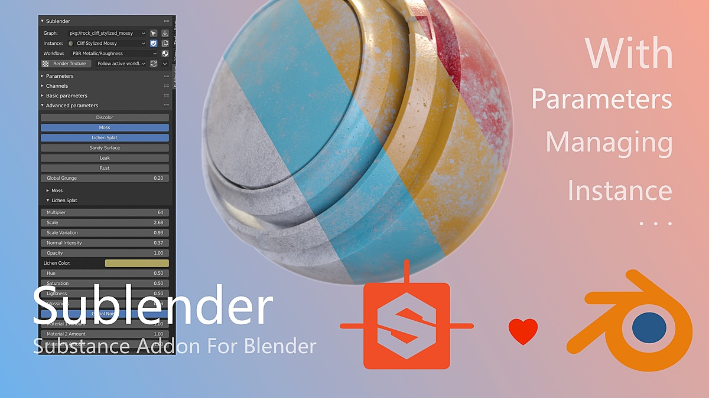
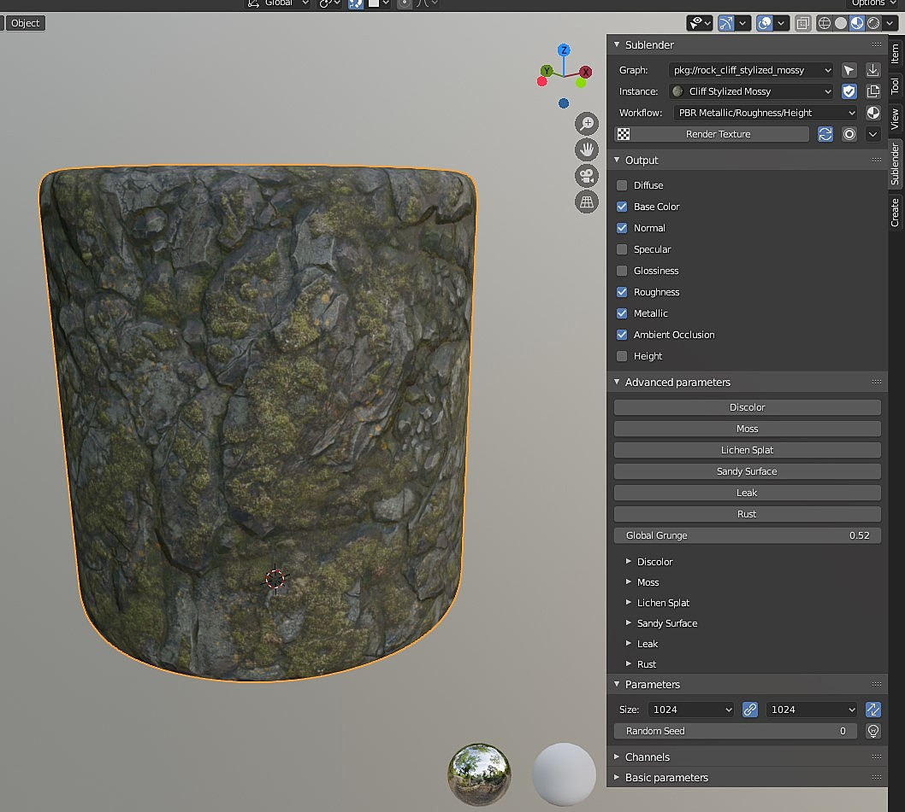

# Sublender
Sublender is a tool for blender loading sbsar file.

## Features
> With Sublender, you can:
1. import sbsar files
2. parameters turning directly inside Blender
3. workflow & material generation
4. live update
5. works in both Windows and Linux  (tested).
## Some Example And Screenshot

## Support Version
* 2.8
* 4.0

## RoadMap
1. ~~Update to support latest version of blender~~
2. 🔨 github action for release and deps collect
3. 🔨 Stable release
4. 🚧 Better documentation