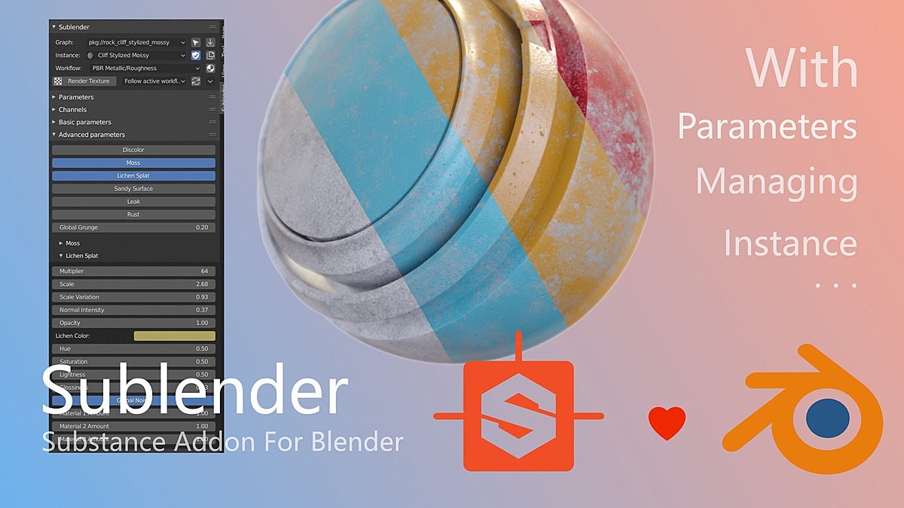
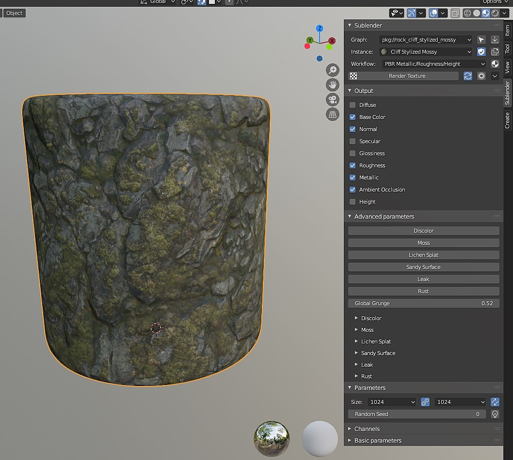

# Sublender
Sublender is a tool for blender loading sbsar file.

## Features
1. import sbsar files
2. parameters turning directly inside Blender
3. workflow & material generation
4. live update
5. works in Windows, Linux, macOS
## Some Example And Screenshot

## Support Version
* 2.8+